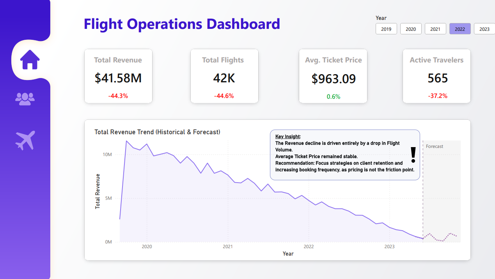
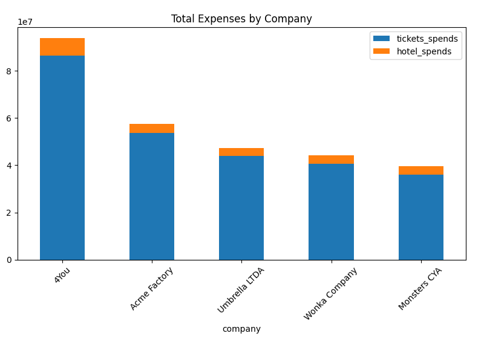
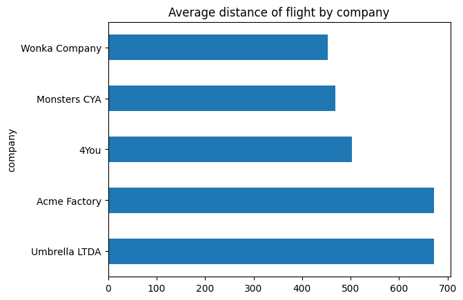
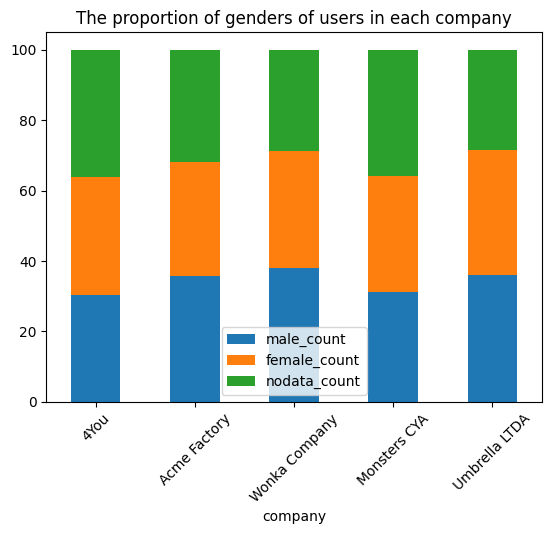
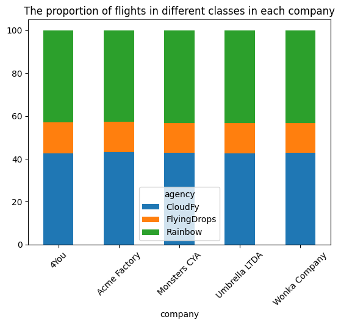

  <a href="README.md">EN</a> | PL

# 📊 Analiza Marketingowa Danych o Podróżach Służbowych ✈️
### Projekt analizujący bazę danych firmy organizującej podróże służbowe. Analiza została przeprowadzona w celu ulepszenia strategii marketingowej firmy i zwiększenia jej zysków.

***

### Aby uzyskać pełny, szczegółowy opis analizy, w tym wszystkie zapytania SQL, wizualizacje i szczegółowe rekomendacje, zobacz [Pełny Raport w Jupyter Notebook](analysis.ipynb).

## 📝 O Projekcie
### Celem projektu jest symulacja roli Analityka Marketingowego/Analityka Danych, analiza dostępnych danych o partnerach i klientach firmy, zidentyfikowanie luk w strategii marketingowej i ich wyeliminowanie poprzez zaproponowanie odpowiednich rozwiązań. Dane pochodzą z **[Kaggle](https://www.kaggle.com/datasets/leomauro/argodatathon2019/data)**

## 🛠️ Stos Technologiczny
*   **Analiza Danych:** SQL (SQLite), Python (Pandas)
*   **Wizualizacja Danych:** Matplotlib, Power BI (w trakcie)
*   **Środowisko :** Jupyter Notebook, VS Code
*   **Kontrola Wersji:** Git & GitHub

  
  
  
  
  
  

***
## 🚀 Wyniki Projektu

*   **Interaktywny Dashboard:** Aby uzyskać dynamiczny przegląd kluczowych wskaźników, możesz zapoznać się z **[Power BI Dashboard](dashboard.pbix)**.

*   **PDF Dashboard:** Aby uzyskać przegląd kluczowych wskaźników, możesz zapoznać się z **[Power BI Dashboard (PDF)](dashboard.pdf)**.

*   **Szczegółowa Analiza:** Aby uzyskać pełny, szczegółowy opis analizy, zobacz **[Pełny Raport w Jupyter Notebook](analysis.ipynb)**.

## ❓ Kluczowe Pytania Biznesowe
*   **Którzy klienci są naszymi najcenniejszymi partnerami i czym różni się struktura ich wydatków (loty vs. hotele)?**
*   **Jakie są kluczowe wzorce i preferencje dotyczące podróży?**
*   **Czy dane demograficzne (wiek, płeć) są istotnym czynnikiem wpływającym na zachowania podróżne naszych klientów, czy powinniśmy skupić się na innych kryteriach segmentacji?**
*   **Jak skuteczne są nasze kanały sprzedaży – agencje?**

## 📊 Kluczowe Spostrzeżenia i Wizualizacje

### Spostrzeżenie 1: Znaczące ryzyko koncentracji sprzedaży, zależność od jednego klienta

 "4You" jest naszym największym klientem, którego wydatki dwukrotnie przewyższają kolejnego konkurenta, co jest wynikiem wyłącznie większej liczby podróży. Stwarza to znaczące ryzyko koncentracji. Naszym głównym celem musi być długoterminowe utrzymanie klienta.

***

### Spostrzeżenie 2: Dla każdej firmy istnieją kluczowe korytarze podróży, które można wykorzystać w budowaniu strategii marketingowej.

 Analiza wykazała, że każdy z naszych kluczowych klientów ma dominujący biznesowy korytarz podróży — parę miast o dużej i stałej liczbie podróży w obu kierunkach. Kluczowe korytarze to:
<ul>
<li><b>4You: Aracaju (SE) ↔ Recife (PE)</b></li>
<li><b>Monsters CYA: Campo Grande (MS) ↔ Sao Paulo (SP)</b></li>
<li><b>Acme Factory: Campo Grande (MS) ↔ Florianopolis (SC)</b></li>
<li><b>Umbrella LTDA: Aracaju (SE) ↔ Florianopolis (SC)</b></li>
<li><b>Wonka Company: Aracaju (SE) ↔ Natal (RN)</b></li>
</ul>
Ten wzorzec wskazuje, że trasy te są powiązane z kluczowymi i cyklicznymi operacjami biznesowymi naszych klientów (np. połączenie centrali z głównym oddziałem). Ta wysoka przewidywalność i wolumen dają nam znaczną przewagę i możliwość stworzenia wysokomarżowej usługi o wartości dodanej, zamiast sprzedawania pojedynczych biletów.

***

### Spostrzeżenie 3: Niektóre firmy mają znacznie dłuższą średnią odległość lotów.

Najprawdopodobniej firmy te mają szerszy zasięg geograficzny lub większy wpływ na biznes międzynarodowy. Musimy więc znaleźć rozwiązania zwiększające komfort i produktywność pasażerów (np. fast track dla klasy ekonomicznej, dostęp do saloników biznesowych, bardziej prestiżowe transfery hotelowe itp.), którzy latają dalej i dłużej, i zaoferować im odpowiedni pakiet takich usług, co zwiększy przychody naszej firmy dzięki marżom na tych usługach.

***

### Spostrzeżenie 4: Baza klientów jest jednorodna pod względem demograficznym.

| company       | users_count | average_age | female_count | male_count | nodata_count |
|---------------|-------------|-------------|--------------|------------|--------------|
| 4You          | 453         | 42.7        | 151          | 138        | 164          |
| Acme Factory  | 261         | 42.1        | 85           | 93         | 83           |
| Wonka Company | 237         | 43.1        | 79           | 90         | 68           |
| Monsters CYA  | 195         | 43.8        | 64           | 61         | 70           |
| Umbrella LTDA | 194         | 42.2        | 69           | 70         | 55           |

Wskazuje to, że nasza baza klientów jest jednorodna pod względem demograficznym. Oznacza to, że czynniki takie jak firma i jej polityka podróży są znacznie silniejszymi predyktorami zachowań podróżnych (takich jak wybór klasy czy celu podróży) niż wiek czy płeć danej osoby.

***

### Spostrzeżenie 5: Ogromna niewykorzystana szansa - niedostatecznie korzystamy z agencji "FlyingDrops".

| agency      | economic_flights | first_class_flights | premium_flights |
|-------------|------------------|---------------------|-----------------|
| CloudFy     | 38656            | 38862               | 38860           |
| FlyingDrops | 0                | 38758               | 0               |
| Rainbow     | 38810            | 38798               | 39144           |

FlyingDrops to nasz wyłączny kanał sprzedaży naszego najbardziej marżowego produktu — First Class. Fakt, że ten kanał odpowiada tylko za 10-15% rezerwacji, nawet wśród naszych klientów premium, to ogromna niewykorzystana szansa.

---